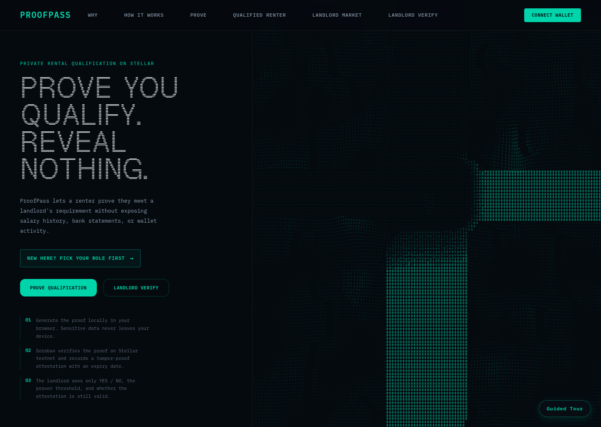
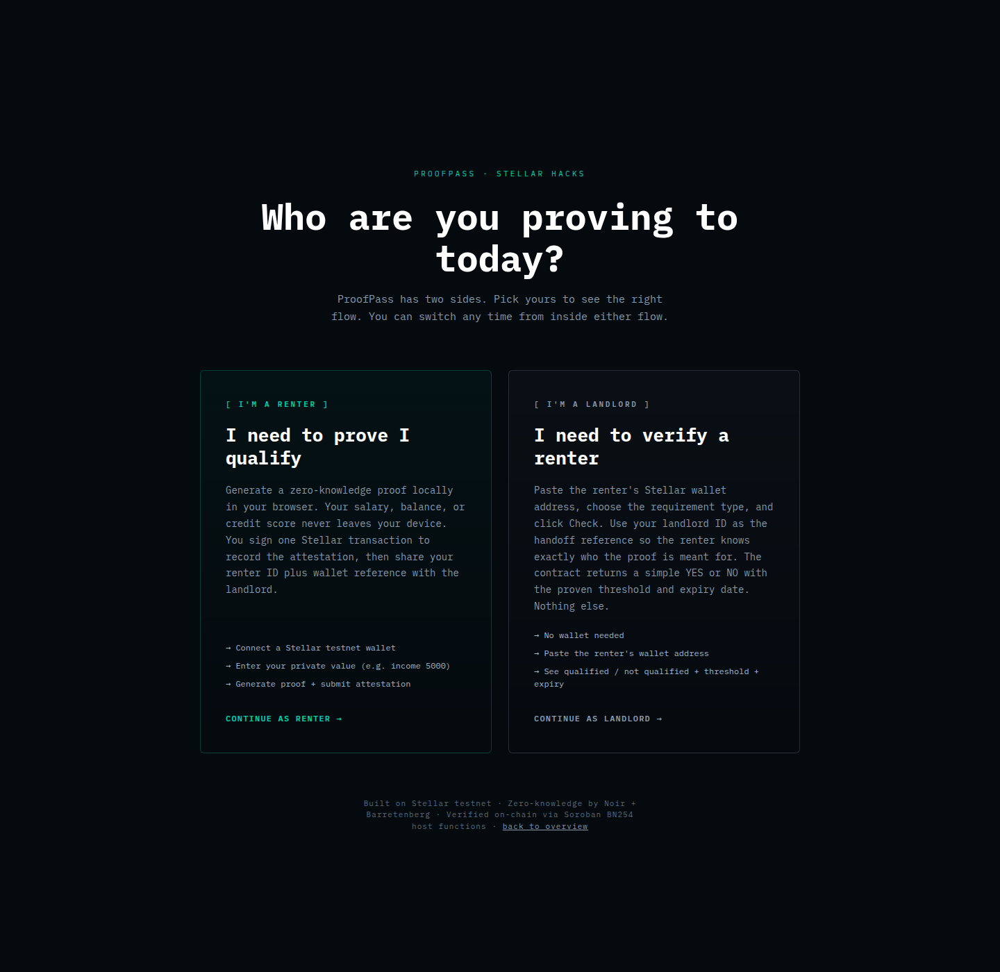
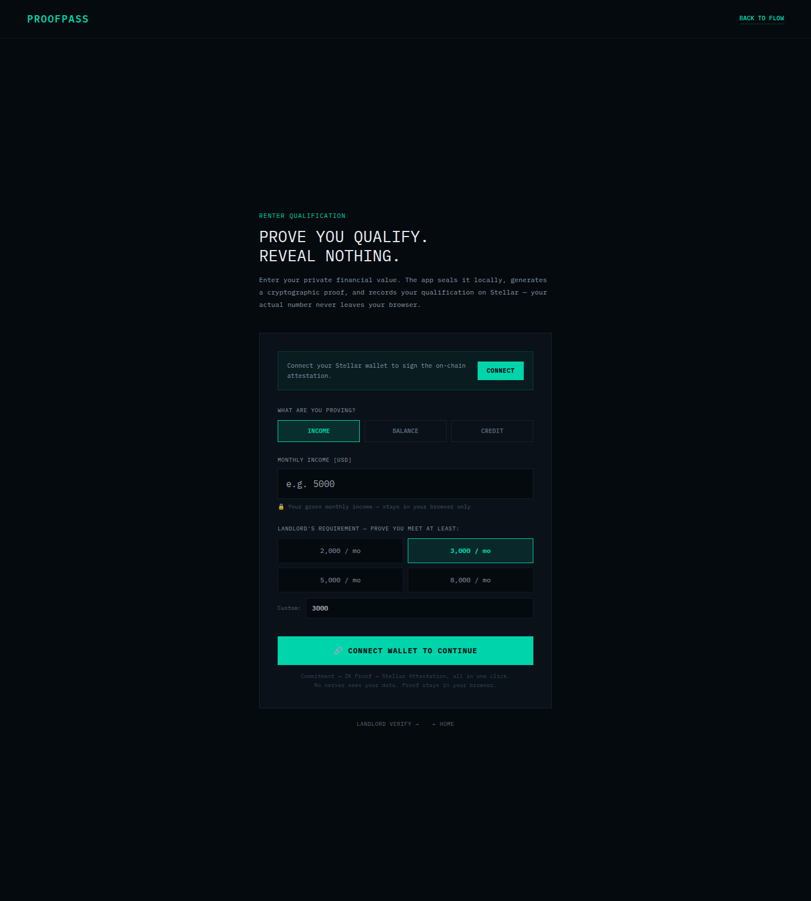
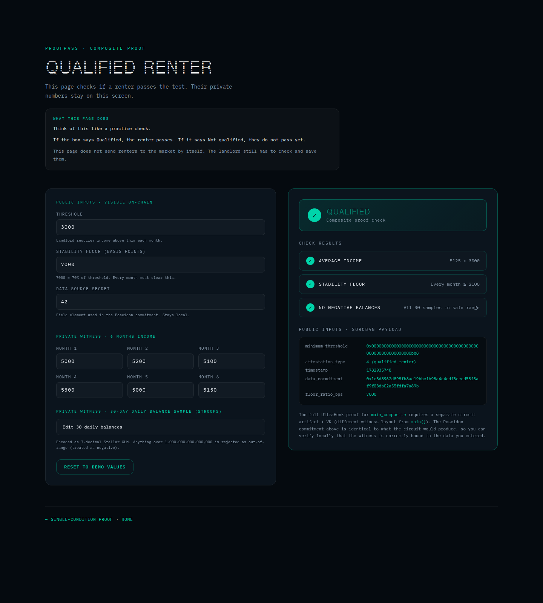
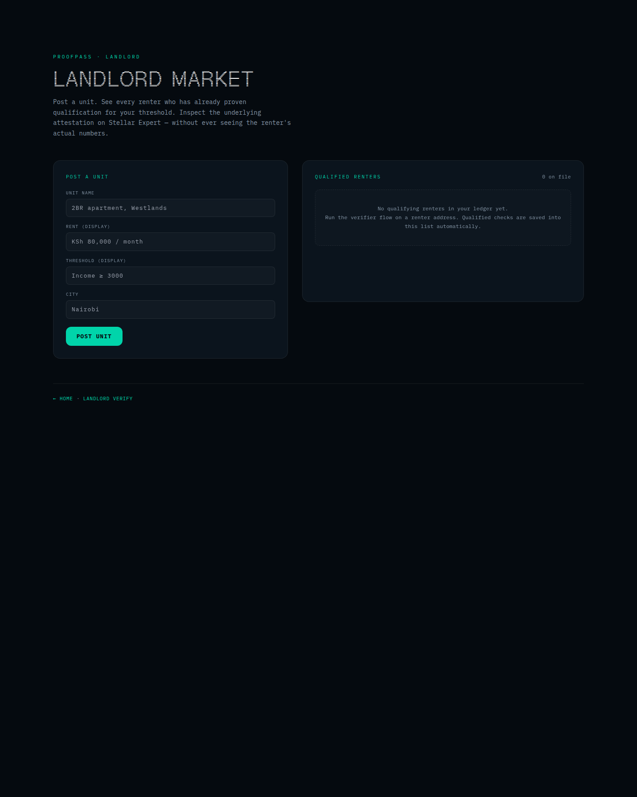
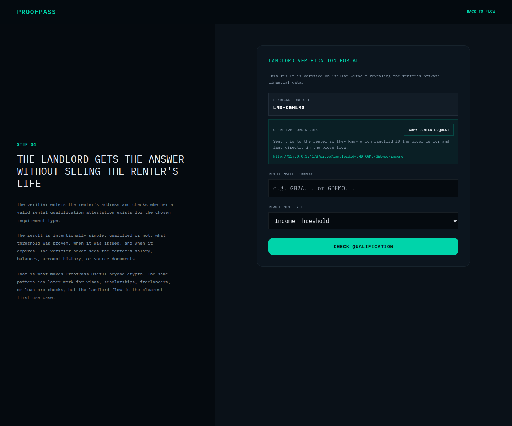

# zkProof — ProofPass


> Prove you qualify without exposing your financial life.

ProofPass is a privacy-preserving rental pre-qualification app built on Stellar.
It lets a renter prove that they meet a landlord’s income or balance requirement without revealing their actual salary, bank statement, or transaction history.

The renter generates the proof locally in the browser.
The verifier gets a simple YES / NO answer, the proven threshold, and an expiry date.
Nothing else is exposed.

## 30-second explanation

A renter enters private financial data locally in the browser.
A zero-knowledge proof shows they meet a landlord’s requirement.
The proof is verified on Stellar.
The landlord sees only:
- qualified / not qualified
- threshold proven
- expiry date

They never see the renter’s raw financial data.

## What the new "Qualified Renter" proof proves

The single-condition verifier above is the product's beating heart.
But real landlords don't rent to people based on one number. The composite
`qualified_renter` proof (`circuits/src/main.nr: main_composite`) proves
**three rules in one ZK proof**, with all amounts staying private:

1. **Income stability** — average monthly income over the last 6 months
   exceeds the threshold.
2. **No income cliff** — every individual month meets a stability floor
   (default 70% of threshold). Catches people who got one big paycheck.
3. **No negative balances** — none of the 30-day daily balance sample is
   negative. Catches people whose bank account is currently in overdraft.

The browser page at [`/qualified`](https://zkproof.vercel.app/qualified) lets
you enter the private witness locally, computes the exact Poseidon
commitment the circuit checks, and shows the public-input payload that the
on-chain verifier would receive — same shape, same commitment, no chain tx
required to inspect.

The market view at [`/market`](https://zkproof.vercel.app/market) is the
product screen judges remember: a landlord posts a unit, sees every renter
who has already proven qualification for that threshold, and inspects the
underlying attestation on Stellar Expert — without ever seeing the
renter's actual numbers.

## Why this matters

Rental qualification is still built around oversharing.
To prove you can afford a home, you are usually asked to reveal bank statements, salary history, employer details, and full transaction trails.

ProofPass changes that tradeoff:
- the renter keeps sensitive financial data local
- the Noir circuit proves only the threshold claim (or all three claims, in the composite mode)
- the Soroban contract verifies the proof on-chain
- the landlord receives a reusable attestation, not the renter’s underlying data

This is why the product is easy to understand beyond crypto: the verifier gets the answer they need, and the renter keeps the rest of their life private.

## Live links

- **Live demo (Vercel):** https://zkproof.vercel.app *(replace with your actual Vercel URL after `vercel --prod`)*
- **Testnet contract:** https://stellar.expert/explorer/testnet/contract/CDUXLEZQ6ZIQV3LN45VJOK5ONKRQOFFAIEK4JXPD63R2PDC5AF5VNJE3
- **Happy-path tx:** https://stellar.expert/explorer/testnet/tx/d060c741e461738b4ba59413dbb288aee6d4266f40ca69b05e9c929e51cc4943
- **Demo video:** *(record per `DEMO_SCRIPT.md`, upload to YouTube, paste the URL here)*
- **Judge quickstart:** [`docs/JUDGE_QUICKSTART.md`](./docs/JUDGE_QUICKSTART.md)
- **Deployment proof:** [`docs/DEPLOYMENT_PROOF.md`](./docs/DEPLOYMENT_PROOF.md)
- **Run locally:** `cd frontend && npm install && NODE_OPTIONS="--max-old-space-size=2048" npm run dev` → http://localhost:3000

## Demo flow

Happy path:
1. The renter enters a private monthly income, for example `5000`.
2. The renter chooses a public requirement, for example `3000`.
3. The browser generates a zero-knowledge proof locally.
4. Soroban verifies the proof and stores a time-bound attestation.
5. The landlord checks the wallet address and sees only the qualification result.

Failure path:
1. The renter enters a value below the requirement, for example income `2500` against threshold `3000`.
2. The proof path should fail or no passing attestation should be issued.
3. The landlord must not see a false-positive qualified result.

## Renter and landlord public IDs

ProofPass generates a public app ID for each role the first time that role enters the flow:

- renter IDs look like `RNT-XXXXXX`
- landlord IDs look like `LND-XXXXXX`

These generated numbers are app-level public references, not blockchain wallets and not secret keys.

What they do:
- give each renter and landlord a stable public label inside the UI
- let the renter share a proof trail that includes both wallet address and renter public ID
- let the landlord save attestations to a landlord ledger with a human-readable reference instead of only a long wallet string
- make shared verification links, screenshots, and ledger exports easier to follow

What they do not do:
- they do not hold funds
- they do not sign Stellar transactions
- they do not replace the renter wallet address
- they do not create an on-chain identity by themselves

How they work today:
- the UI generates the ID on first role entry
- the ID is stored locally in the browser for that role
- the renter public ID is attached to the shared landlord verification link
- the landlord public ID is attached to saved landlord ledger records
- the wallet address and on-chain attestation remain the real verification source of truth

Why this design matters:
- generating random blockchain wallets here would create custody, recovery, and UX problems
- the renter should keep using their real Stellar wallet for actual on-chain attestations
- ProofPass adds a shareable public reference layer so humans can track who is who without turning the app into a wallet provider

Authenticity model:
- the public ID helps people coordinate off-chain
- the renter wallet, tx hash, contract link, and Stellar Expert pages prove authenticity on-chain
- landlords should treat the public ID as a readable label, not as the cryptographic proof itself

In short: the generated renter and landlord numbers are public reference IDs that make the handoff cleaner, while the actual proof remains anchored to the renter wallet and Stellar attestation.

## Judge quickstart

1. Open the live demo.
2. Run the renter flow with the sample values.
3. Open the landlord verifier view.
4. Confirm the YES / NO result and expiry.
5. Inspect the contract or transaction on Stellar Expert.
6. Run the below-threshold failure case.

Full walkthrough: [`docs/JUDGE_QUICKSTART.md`](./docs/JUDGE_QUICKSTART.md)

## What the verifier sees

```text
Status: Qualified
Requirement proven: Income >= 3000
Issued: <timestamp>
Expires: <timestamp>
Network: Stellar Testnet
```

## What the verifier does not see

```text
Exact salary or income amount
Bank account balances or transaction history
Employer details
Source documents
Any private witness data used to generate the proof
```

## Failure case: below-threshold renter

Canonical happy path:
- income = `5000`
- threshold = `3000`
- expected result = attestation issued / verifier sees qualified

Canonical failure path:
- income = `2500`
- threshold = `3000`
- expected result = proof generation fails or no valid attestation is issued

### Why judges should care about the failure case

Without this failure case, the product could be dismissed as a UI wrapper around unverifiable claims.
The failed proof path shows the zero-knowledge circuit is enforcing the rule itself.
That is what makes ZK load-bearing here.

## Architecture

```text
Renter browser
  ├─ Enter private financial data locally
  ├─ Compute Poseidon commitment locally
  ├─ Execute Noir circuit locally
  └─ Generate UltraHonk proof in-browser
            │
            ▼
Soroban smart contract on Stellar
  ├─ Verify BN254/UltraHonk proof on-chain
  ├─ Cross-check public inputs
  └─ Store time-bound attestation
            │
            ▼
Landlord verifier
  └─ Query YES/NO + threshold + expiry without seeing raw finances
```

## Why this is not just another proof-of-funds demo

Most competing privacy projects in this lane are either:
1. crypto-native payment/privacy infrastructure, or
2. institutional compliance / solvency tools.

ProofPass is different because it solves a normal human problem in plain English:
- a renter needs to prove they qualify
- a landlord needs a yes/no answer
- neither side needs to understand blockchain internals

That is the product wedge.

## ZK is load-bearing

This project is not using ZK as decoration.
If the proof layer is removed, the product collapses into the exact privacy failure it is trying to solve, because the landlord would need direct access to bank statements, payroll records, or account balances to validate the claim.

ZK is load-bearing because it:
- enforces the threshold check without exposing the witness
- enables a public verifier contract without leaking private financial data
- turns an invasive process into a reusable privacy-preserving attestation
- creates a product that cannot exist credibly without zero-knowledge proofs

## Submission snapshot

- Hackathon: [Stellar Hacks: Real-World ZK](https://dorahacks.io/hackathon/stellar-hacks-zk)
- Circuit: [`circuits/src/main.nr`](./circuits/src/main.nr)
- Soroban verifier: [`contracts/src/lib.rs`](./contracts/src/lib.rs)
- Frontend prover flow: [`frontend/src/lib/prover.ts`](./frontend/src/lib/prover.ts)
- Frontend chain integration: [`frontend/src/lib/stellar.ts`](./frontend/src/lib/stellar.ts)
- Current testnet contract ID: `CDUXLEZQ6ZIQV3LN45VJOK5ONKRQOFFAIEK4JXPD63R2PDC5AF5VNJE3`

## Local setup

Prerequisites:
- Node.js + npm
- Rust + Cargo
- Noir / `nargo`
- Stellar CLI for deployment

```bash
git clone https://github.com/Toji254/zkproof.git
cd zkproof
./scripts/build.sh
./scripts/deploy.sh
cd frontend
npm install
NODE_OPTIONS="--max-old-space-size=2048" npm run dev
```

The build script compiles the Noir circuit, copies `zkproof.json` into `frontend/public/`, and builds the Soroban contract WASM.

## Testnet verification

Recommended sequence:

```bash
./scripts/build.sh
./scripts/deploy.sh
./scripts/update-vk.sh
./scripts/check-vk-status.sh
./scripts/test-flow.sh
```

`node frontend/scripts/gen-vk.mjs` now uses the keccak UltraHonk VK path that matches the Soroban verifier and writes the expected 1760 raw bytes to `circuits/target/vk.bin`. If the helper still fails, open the frontend at `/ops`, use `Export Verification Key`, save the downloaded file to `circuits/target/vk.bin`, and re-run `./scripts/update-vk.sh`.

See [`docs/DEPLOYMENT_PROOF.md`](./docs/DEPLOYMENT_PROOF.md) for the deployment checklist and expected outputs.

## Screenshots

Actual UI screenshots captured from the running app:

**Homepage — landing and entry**


**Role selection — renter vs landlord flow**


**Renter proof flow — private value stays in the browser**


**Qualified Renter — composite proof view**


**Landlord market — post units and review qualified renters**


**Landlord verification portal — yes/no check without raw financial data**


## On-chain proof of execution

- Contract: https://stellar.expert/explorer/testnet/contract/CDUXLEZQ6ZIQV3LN45VJOK5ONKRQOFFAIEK4JXPD63R2PDC5AF5VNJE3
- Happy-path attestation tx: https://stellar.expert/explorer/testnet/tx/d060c741e461738b4ba59413dbb288aee6d4266f40ca69b05e9c929e51cc4943
- Live evidence log: [`docs/EVIDENCE.md`](./docs/EVIDENCE.md) — `test-flow.sh` output, the previously recorded balance attestation, and a live failure-path simulation showing `attest()` returning `false` on an invalid proof without writing any contract state.

## One-command deploy (Vercel)

`vercel.json` is configured for the Vite frontend at the repo root. From a
fresh clone:

```
npm --prefix frontend ci
cd frontend && npm run build
# then either `vercel` for a preview or `vercel --prod` to promote
```

Required env vars on Vercel:
- `VITE_CONTRACT_ID` — defaults to the testnet value in `frontend/.env.example`
- `VITE_NETWORK` — `TESTNET`

## Demo video

- Script: [`DEMO_SCRIPT.md`](./DEMO_SCRIPT.md)
- Video link: *(record the 90-second walkthrough per the script, upload to YouTube, paste the URL here)*

## Repository structure

```text
zkproof/
├── circuits/                  # Noir circuit and proving inputs
├── contracts/                 # Soroban verifier + attestation registry
├── frontend/                  # React/Vite UI and client-side proving flow
├── scripts/                   # Build, deploy, smoke-test, and VK update scripts
├── docs/                      # Judge quickstart, deployment proof, positioning
├── DEMO_SCRIPT.md             # Recording script for the demo
├── README.md                  # Submission-facing overview
└── .contract-id               # Current deployed contract ID
```

## License

This project is released under the [MIT License](./LICENSE).
