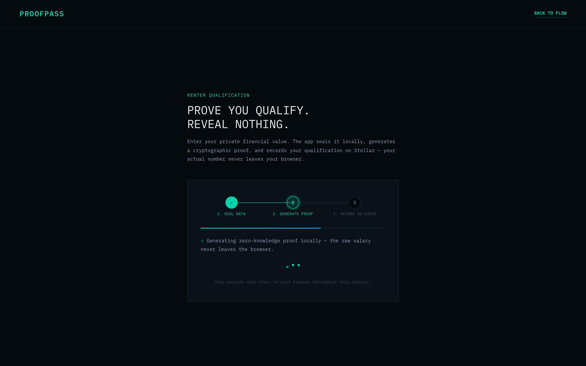
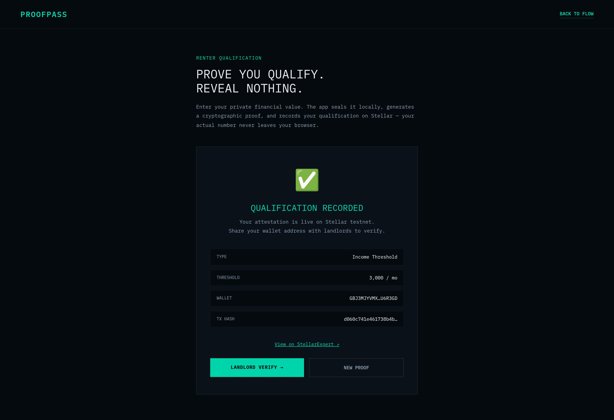

# zkProof — Zero-Knowledge Financial Attestation Protocol


> Prove It. Without Showing It.

zkProof is a privacy-preserving financial attestation protocol built for Stellar Hacks: Real-World ZK. It lets a user prove a financial claim such as "my monthly income is above $3,000" without revealing the income itself, the source account, or any raw financial history.

Judges can think of zkProof as a new primitive for compliance, rentals, lending, DAO access, and DeFi eligibility: verifiable threshold checks without surveillance.

## Why this matters

Today, eligibility checks are blunt instruments. To rent an apartment, join a gated pool, or pass a source-of-funds review, users are often forced to overshare entire bank statements, payroll records, or transaction history.

zkProof changes that tradeoff:
- the user keeps sensitive financial data local
- the Noir circuit proves only the threshold claim
- the Soroban contract verifies the proof on-chain
- the verifier receives an attestation, not the underlying data

## Submission snapshot

- Hackathon: [Stellar Hacks: Real-World ZK](https://dorahacks.io/hackathon/stellar-hacks-zk)
- Circuit: [`circuits/src/main.nr`](./circuits/src/main.nr)
- Soroban verifier: [`contracts/src/lib.rs`](./contracts/src/lib.rs)
- Frontend prover flow: [`frontend/src/lib/prover.ts`](./frontend/src/lib/prover.ts)
- Frontend chain integration: [`frontend/src/lib/stellar.ts`](./frontend/src/lib/stellar.ts)
- Current testnet contract ID: `CDUXLEZQ6ZIQV3LN45VJOK5ONKRQOFFAIEK4JXPD63R2PDC5AF5VNJE3`
- Testnet explorer: https://stellar.expert/explorer/testnet/contract/CDUXLEZQ6ZIQV3LN45VJOK5ONKRQOFFAIEK4JXPD63R2PDC5AF5VNJE3

## What the verifier sees

```text
YES — address holds a valid income attestation above the required threshold.
Issued at: <timestamp>
Expires at: <timestamp>
```

## What the verifier does not see

```text
Exact income amount
Bank account balances or transaction history
Employer details
Source documents
Any private witness data used to generate the proof
```

## Architecture

```text
User browser
  ├─ Enter private financial data locally
  ├─ Compute Poseidon commitment locally
  ├─ Execute Noir circuit locally
  └─ Generate UltraHonk proof in-browser
            │
            ▼
Soroban smart contract on Stellar
  ├─ Verify BN254/UltraHonk proof on-chain
  ├─ Cross-check public inputs
  └─ Store time-bound attestation
            │
            ▼
Verifier
  └─ Query YES/NO + threshold + expiry without seeing raw finances
```

## ZK is load-bearing

This project is not using ZK as decoration.

Zero-knowledge is the only reason zkProof works. If the proof layer is removed, the protocol collapses into the exact privacy failure it is trying to solve, because the verifier would need direct access to bank statements, payroll data, or account balances to validate the claim.

That makes ZK cryptography load-bearing in the strongest possible sense:
- it enforces the threshold check without exposing the witness
- it enables a public verifier contract without leaking private finance data
- it turns an otherwise invasive workflow into a privacy-preserving attestation primitive
- it creates a product that cannot exist as a credible system without zero-knowledge proofs

## Quick start

Prerequisites:
- Node.js + npm
- Rust + Cargo
- Noir / `nargo`
- Stellar CLI for deployment

```bash
git clone https://github.com/Toji254/zkproof.git
cd zkproof
./scripts/build.sh
./scripts/deploy.sh
cd frontend
npm install
NODE_OPTIONS="--max-old-space-size=2048" npm run dev
```

The build script compiles the Noir circuit, copies `zkproof.json` into `frontend/public/`, and builds the Soroban contract WASM.

## Screenshots

Placeholder paths are wired for submission packaging and can be swapped for final exported images later:

- `frontend/public/images/step1-data.jpg`
- `frontend/public/images/step2-proof.jpg`
- `frontend/public/images/step3-chain.jpg`
- `frontend/public/images/step4-verify.jpg`

Example markdown:






## Video Demo

- Demo script: [`DEMO_SCRIPT.md`](./DEMO_SCRIPT.md)
- Placeholder YouTube link: https://www.youtube.com/watch?v=YOUR_DEMO_ID

## Technical Deep Dive

### 1. How the Noir circuit works

The core circuit lives in [`circuits/src/main.nr`](./circuits/src/main.nr).

It accepts private witness inputs:
- `monthly_income`
- `data_source_secret`

And public inputs:
- `minimum_threshold`
- `attestation_type`
- `timestamp`
- `data_commitment`

Inside the circuit, zkProof enforces six important constraints:
1. the private value must be greater than the claimed public threshold
2. the private value must stay within a sane range
3. the threshold must be positive
4. the attestation type must be valid
5. the timestamp must be recent enough
6. the public commitment must match a Poseidon hash of the secret and private value

This means the proof does not just say "trust me". It proves the witness satisfies a very specific financial predicate and is bound to a commitment that prevents easy fabrication.

### 2. How the Soroban verifier works

The on-chain verifier lives in [`contracts/src/lib.rs`](./contracts/src/lib.rs).

Its `attest()` function:
- checks proof and public-input byte lengths
- loads the stored verification key
- runs UltraHonk proof verification on-chain
- re-checks threshold, attestation type, and timestamp against the submitted public inputs
- stores an attestation keyed by `(address, attestation_type)`
- assigns a 90-day expiry window
- exposes read APIs for `check()` and `get_attestation()`

That design matters because the contract is not only a cryptographic verifier. It is also the registry layer that turns a valid proof into a reusable on-chain credential.

### 3. How client-side proving works

Client-side proving is implemented in [`frontend/src/lib/prover.ts`](./frontend/src/lib/prover.ts).

The frontend flow is:
1. load the compiled Noir artifact from `/zkproof.json`
2. lazy-load `@aztec/bb.js` and `@noir-lang/noir_js`
3. compute a Poseidon commitment in-browser
4. execute the Noir circuit to build the witness
5. generate an UltraHonk proof in the browser
6. serialize four 32-byte public inputs for the Soroban contract
7. submit the proof on-chain through [`frontend/src/lib/stellar.ts`](./frontend/src/lib/stellar.ts)

This is important for the user experience and the privacy model: the raw financial witness stays in the browser, while only the proof and public inputs go to the chain.

### 4. Why ZK is load-bearing for judge criteria

For the DoraHacks judging lens, zkProof uses zero-knowledge as the core enabling mechanism, not as a cosmetic add-on.

Without ZK:
- there is no privacy-preserving threshold proof
- the verifier would need raw financial documents
- the chain could only store either nothing useful or too much sensitive data
- the product would fail its core promise

With ZK:
- the user proves eligibility without surveillance
- the verifier gets an objective yes/no result
- the attestation becomes portable and on-chain
- Stellar becomes the settlement and verification layer for private financial claims

That is why ZK is load-bearing here: it is the bridge between privacy and verifiability.

## Repository structure

```text
zkproof/
├── circuits/                  # Noir circuit and proving inputs
├── contracts/                 # Soroban verifier + attestation registry
├── frontend/                  # React/Vite UI and client-side proving flow
├── scripts/                   # Build, deploy, smoke-test, and VK update scripts
├── DEMO_SCRIPT.md             # Recording script for the 2:30 hackathon demo
├── README.md                  # Submission-facing overview
└── .contract-id               # Current deployed contract ID
```

## Contributing

Contributions are welcome, especially around:
- additional attestation types such as balance or credit score proofs
- stronger data-source attestation pipelines
- production-grade verification key management
- UX improvements for wallet connection and proof generation
- benchmark and gas-cost analysis for on-chain verification

Suggested flow:
1. fork the repository
2. create a feature branch
3. keep changes scoped and documented
4. include verification steps or screenshots for UI changes
5. open a pull request with context on the problem, solution, and tradeoffs

## License

This project is released under the [MIT License](./LICENSE).
